# user-demographics-prediction-movielens
Predicting user demographics from movie ratings using genre-based features and latent embeddings.

---
## Project Overview

This project explores the prediction of user demographics (gender and age groups) from movie rating behavior using the MovieLens 1M dataset.

In search of improved predictive performance, different feature representations of user preferences are compared. We start with explicit genre-based features derived from rating statistics, and then move to latent user embeddings obtained through matrix factorization of the user–movie interaction matrix. Finally, both representations are combined to evaluate whether they capture complementary information.

Alongside performance comparisons, the project also examines how these representations reflect underlying patterns in user preferences.

---
## Dataset

This project uses the MovieLens 1M dataset, which contains approximately 1 million ratings from 6,000 users on 4,000 movies. The dataset includes three main components: user information (including gender and age), movie metadata (titles and genres), and user–movie ratings.

The dataset is publicly available and can be downloaded from:
https://grouplens.org/datasets/movielens/1m/

Due to licensing and size considerations, the dataset is not included in this repository.

### Data Exploration

Basic exploration of the dataset reveals several important characteristics that influence model performance.

- The dataset is **imbalanced with respect to gender**, with a clear majority of male users. This is reflected in model behavior, where predicting the minority class proves more difficult.

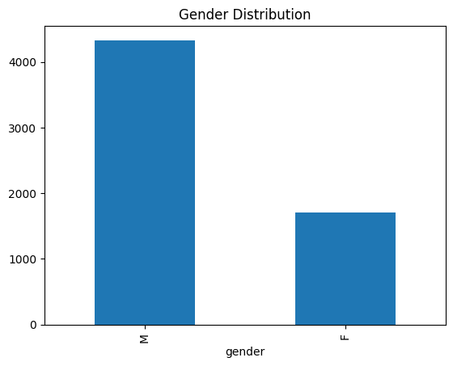

- Age distribution is also uneven, with the largest group concentrated around the 25–34 range. This makes fine-grained age prediction more challenging, particularly for smaller age groups.

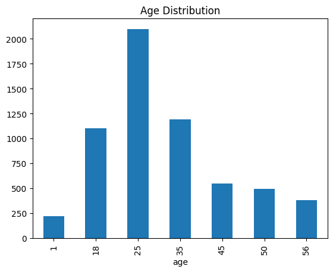

- Ratings are skewed toward higher values (3–5), indicating generally positive user feedback. This suggests that differences in user preferences are subtle and not driven by extreme rating behavior.

<!-- 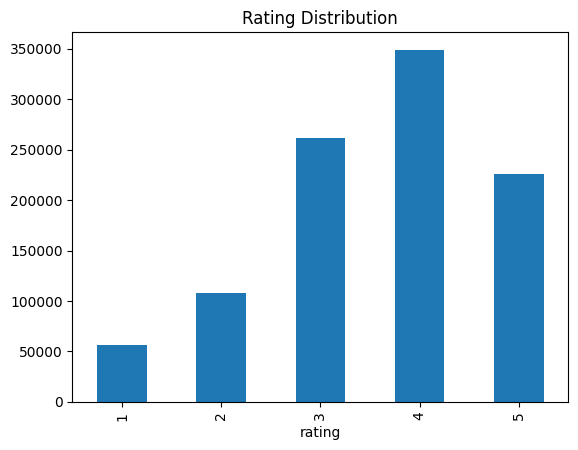 -->

---
## Methodology and Results

### Genre-Based Features

The first approach uses explicit features derived from user rating behavior. Each user is represented using simple statistics such as average rating, rating distribution, and genre-based preferences (e.g., frequency and average rating per genre).

Using these features, both Logistic Regression and Random Forest achieve moderate performance. For gender prediction, accuracy reaches around 0.75–0.78,

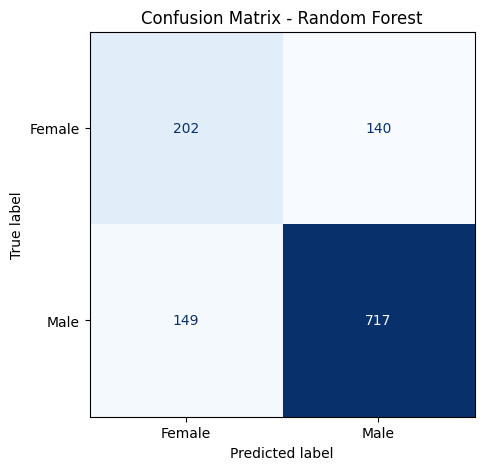

while age prediction proves more difficult, with accuracy remaining relatively low.

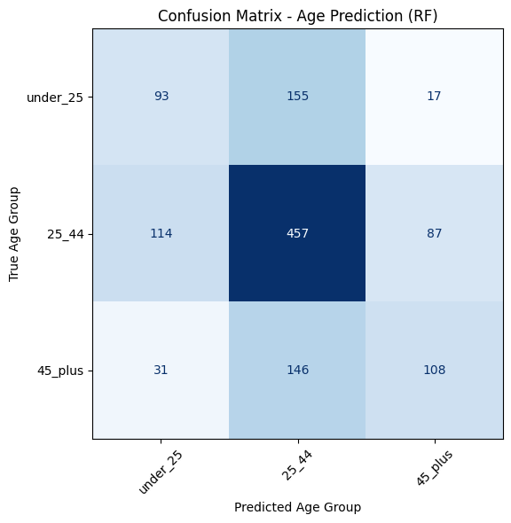

Feature importance analysis highlights genre preferences as the key predictors, with genres such as **Romance** and **Action** consistently appearing among the most informative features. This result is intuitive and aligns with common expectations about differences in movie taste.

Overall, explicit genre-based features provide an interpretable but limited representation of user preferences, capturing only coarse patterns in behavior.

### Latent Embeddings

To capture more complex patterns, user preferences are represented using latent embeddings obtained through matrix factorization. A user–movie rating matrix is constructed and decomposed using Truncated SVD, producing a low-dimensional representation of each user in terms of latent factors.

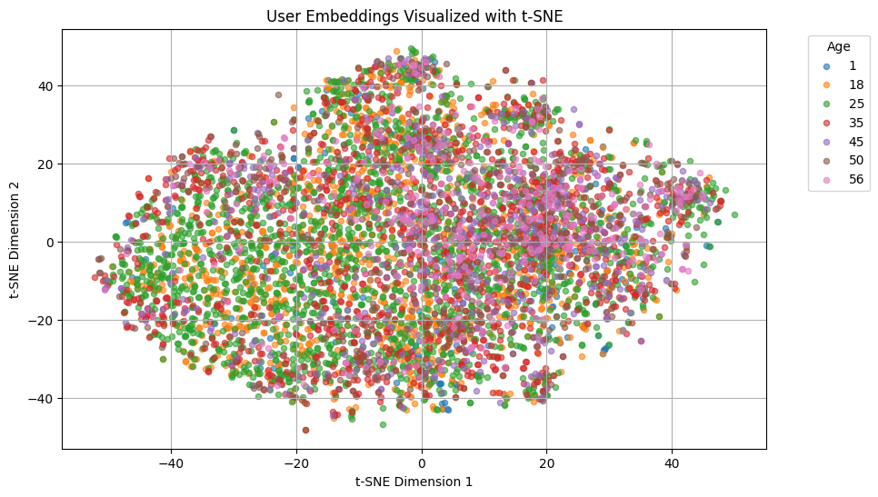

*t-SNE plot with regard to **age classes***

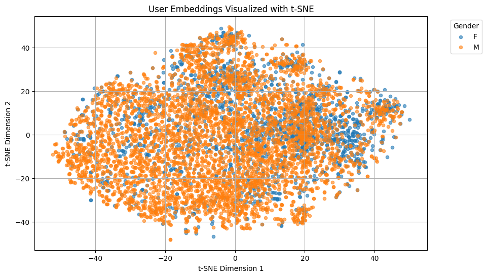

*t-SNE plot with regard to **gender classes***

These embeddings lead to improved performance, particularly for age prediction. While gender prediction remains in a similar range (~0.75–0.77 accuracy), age classification benefits more noticeably, indicating that latent representations capture patterns not directly visible in explicit features.

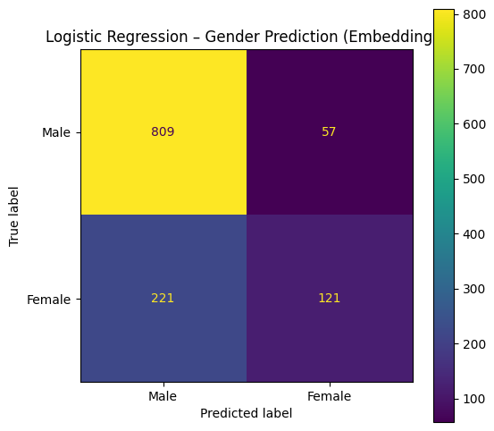

*Logistic regression for **gender** classification (embeddings)*

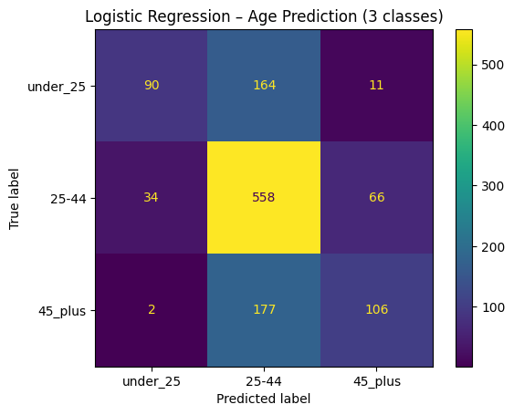

*Logistic regression for **age** classification (embeddings)*

The result suggests that the relation is predominantly linear, so logistic regression performs slightly better then random forest.

Importantly, the latent features can be interpreted by examining the movies that contribute most strongly to each dimension. One of the most informative factors separates users who prefer action and science fiction films (*Star Wars*, *The Matrix*, *The Godfather*) from those favoring romance and lighter content (*Clueless*, *The Little Mermaid*, *When Harry Met Sally*), closely mirroring patterns observed with explicit genre features. Other dimensions reveal additional structure, distinguishing between critically acclaimed, drama-heavy films (*The Shawshank Redemption*, *Schindler’s List*) and more spectacle-driven genre movies (*Alien*, *Blade Runner*), as well as between modern, unconventional cinema and classic Hollywood films. Together, these patterns suggest that embeddings capture not only genre preferences, but also deeper aspects such as tone, style, and generational exposure.

Overall, latent embeddings provide a richer and more flexible representation of user behavior, leading to improved performance and more nuanced insights compared to explicit features.

### Combined Features

In the final stage, the two representations are combined into a single feature set, merging explicit genre-based descriptors with latent embeddings. This hybrid approach yields the strongest overall performance, particularly for gender prediction, where Logistic Regression reaches approximately 0.80 accuracy and provides the most balanced results across classes.

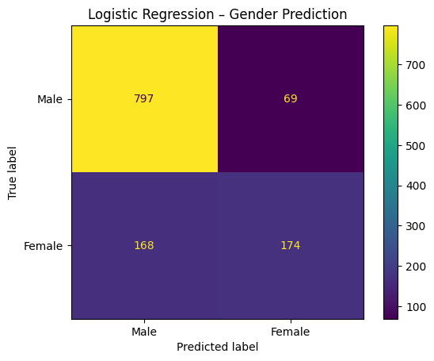

For age prediction, the combined features also improve performance, but only slightly compared to embeddings alone. This suggests that while genre-based features add some complementary information, most of the useful signal for age is already captured by the latent representations.

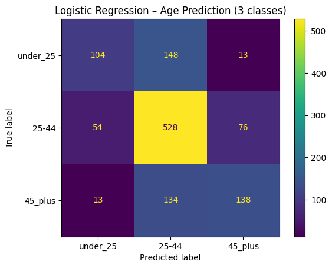

Overall, combining both approaches leads to consistent but modest improvements, indicating that explicit and latent features capture partially overlapping aspects of user preferences.

### Final Comparison

Across all experiments, different feature representations prove more effective depending on the task. For gender prediction, the best results are achieved using the combined feature set, suggesting that both explicit genre preferences and latent behavioral patterns contribute useful information. For age prediction, latent embeddings are the dominant representation, with combined features offering only marginal gains.

In all settings, Logistic Regression performs as well as or slightly better than Random Forest, indicating that the learned feature spaces—particularly the latent embeddings—are largely well-structured and do not require complex non-linear models.

Overall, the results show that while user rating behavior contains meaningful demographic signals, the choice of feature representation plays a crucial role in how effectively these patterns can be captured.

---
## Key Findings

- User rating behavior contains measurable signals for both gender and age, though these signals are relatively weak and influenced by class imbalance.

- Explicit genre-based features provide an interpretable but limited representation of user preferences, capturing only coarse patterns.

- Latent embeddings derived from matrix factorization capture deeper behavioral structure and significantly improve age prediction.

- For gender prediction, combining genre-based features with embeddings yields the best performance, suggesting that both representations provide complementary information.

- For age prediction, embeddings are the dominant representation, with combined features offering only marginal improvements.

- Logistic Regression consistently performs as well as or better than Random Forest, indicating that the learned feature spaces are largely well-structured and close to linearly separable.

- Latent features are interpretable and reveal meaningful preference patterns, such as contrasts between action vs. romance, serious vs. entertainment-driven content, and modern vs. classic cinema.
